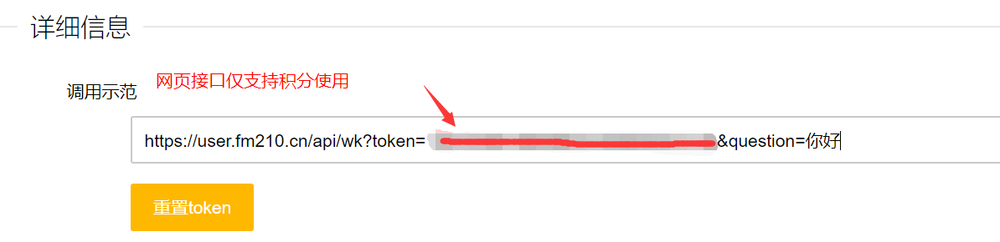

1. 为了获取查题token， 登录`http://user.fm210.cn/user/passport/register.html?yqm=12458`网站注册一个帐号，注册成功后可获赠5000积分(免费查询5000道题)
2. 在用户中心将自己的token记录下来，如图红线处。

3. 在源代码的`ana.py`文件中的第18行，将你的token填入到url中，即`"https://user.fm210.cn/api/wk?token=你的token"`

4. 进入形势与政策的必答自测页面，比如进入了`必答自测1`,当题目加载完之后，按`ctrl+s`，保存页面，保存到`ana.py`的同级目录中，文件名就根据试卷命名，如`"必答自测1.html"`，**注意后缀是.html**。在源代码的第38行，将name改为你的文件名。
5. 运行程序，得到的结果会存在同级目录下的`"文件名.csv"`中。
6. ps： **由于查题接口的答案并不准确，对答案有疑问的可以接入别的接口**。

7. 本脚本只能自动查题，并不能自动将答案填入网页。
8. 有问题可在issue中提出。